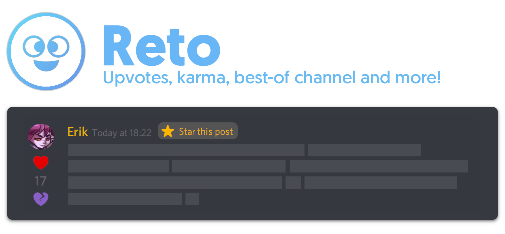

# Reto
Reto is an upvote and downvote system akin to Reddit, for Discord! Any user can heart a message they particularly like (or crush a message they don't quite enjoy) by reacting to said message with a :plus: or :minus: to add or subtract to an user's Karma score. Not only that, but users with the "Curator" role have access to the :10: emoji, which will grant the message-poster 10 points towards their Karma, and send the message to a "#best-of" channel for all the world to see. This bot is perfect for personal and community channels that want to have an alternative scoring system to that of levelling up, and want to showcase how fun and interesting their community is!

## Getting Started
You can add Reto to your server [by clicking on this link!](https://discordapp.com/api/oauth2/authorize?client_id=591466921812164608&permissions=1342449744&scope=bot)
Afterwards, send the command **?setup** on chat to get the bot ready to go. You'll need the "Manage Messages" permission to execute this command. This will:

- create the role "Curators"
- add you to said role
- create the channel #best-of (you can rename it later!)
- create a emoji exclusive to the role "Curators": the Star (:10:)
- create emojis available for everyone (Heart :plus: and Crush :minus:)

Make sure the bot has the appropiate permissions and that there's enough space for three new custom emoji in your server! After you're done, you can react to any message with any of the three supported emojis and Rēto will respond accordingly and update the karma of the commenter. You can check your karma with **?karma**, check other people's karma with **?karma @{USER}**, edit the default emojis with **?emoji edit** *emoji name*, check out a series of leaderboards, for who has the most karma (**?leaderboard** / **?globalleaderboard**) or the best posts (**?postleaderboard** / **?globalpostleaderboard**) and read all the other commands with **?help**.

## Self-hosting Reto
Want to host Reto on your own machine? [Read this guide](https://github.com/despedite/reto/wiki/Self-hosting-Reto) on how to do exactly that!

##### Rēto was originally made for the [Discord Hack Week 2019](https://discord.gg/hackweek).
